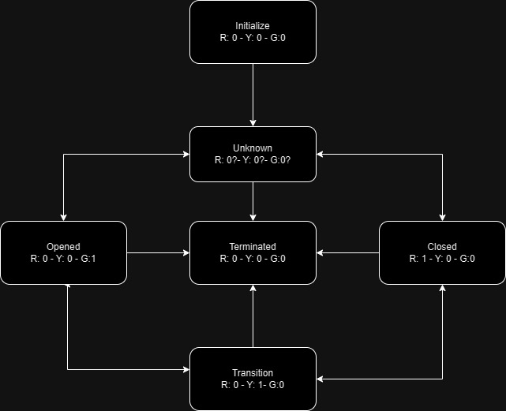

# Traffic Light with State Design Pattern

# Index

1. [Project Structure](#project-structure)
2. [Compilation and Execution](#compilation-and-execution)
3. [Unit Testing](#unit-testing)
4. [Code Description](#code-description)
5. [Diagrams](#diagram)
6. [Next Steps](#next-steps)

This application implements a traffic light using the State Design Pattern in C++. The traffic light has different states such as "Open", "Closed", and "Unknown", along with transitions between these states.
```
STATUS = In progress
```

## Project Structure

The project is organized as follows:

- **`Inc`**: Folder containing header files (.hpp).
- **`Src`**: Folder containing implementation files (.cpp).
- **`build`**: Folder where compiled files are stored.
- **`makefile`**: Configuration file for compiling the project.

## Compilation and Execution

To compile the project, simply run the following command in the terminal:

```
make
``` 

This will compile the source code and generate an executable named `semaphore` in the `build` folder.

To run the program, use the following command:

```
./build/Semaphore
```

To compile Doxygen documentation:
```
doxygen Doxygen
```

## Unit Testing

The next steps will involve adding unit tests using Google Test (gtest).

// Add unit tests here

## Code Description

The source code consists of several classes representing different states of the traffic light, such as "Open", "Closed", and "Unknown". Each state has its own implementation that handles state-specific logic and transitions to other states.

## Diagrams


## Next Steps
* Review of typo/style errors
* Implement unit tests
* Implement git actions
* Implement trace
* Implement Server Pattern
* Implement GUI